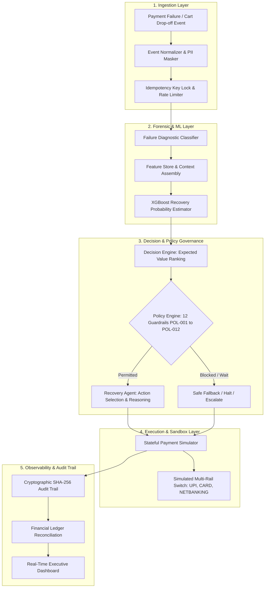
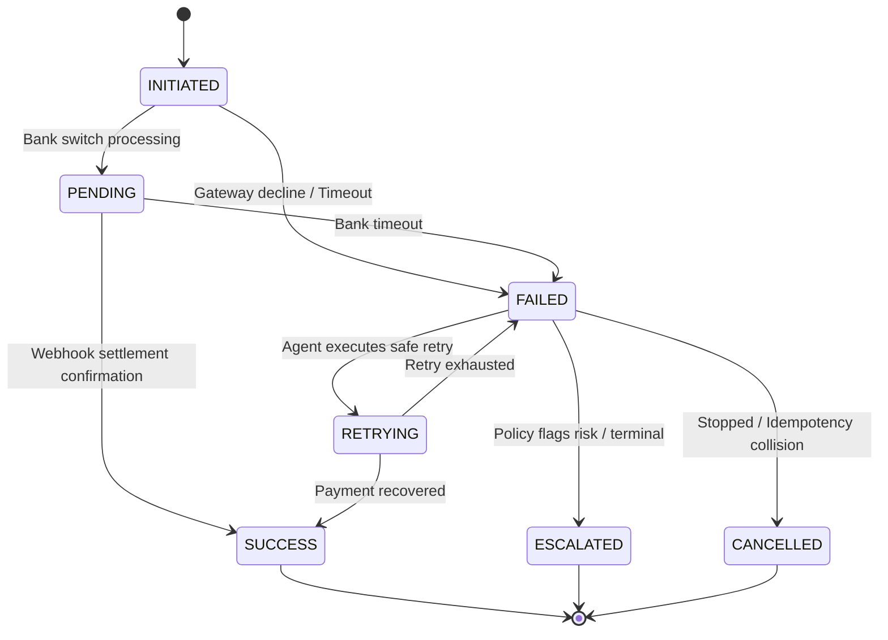

# RazorRecover AI

> **Autonomous Revenue Recovery Engine for Payment Failures & Abandoned Checkouts**  
> *A Safety-Gated, Explainable AI Fintech Platform for Real-Time Payment Orchestration*

---

> [!IMPORTANT]
> ### 🛡️ Prototype & Hackathon Disclaimer
> - **Synthetic Data**: All payment data, customer profiles, risk metrics, and transaction identifiers used in this prototype are **100% synthetically generated**.
> - **Simulated Execution**: All payment executions, retries, method switches, and banking responses are **simulated** inside a stateful sandbox finite state machine.
> - **No Real Customer / Payment Data**: **No real customer or payment data is used** anywhere in this project.
> - **No Real Money**: **This prototype does not process real money**, connect to live financial rails, or interface with production banking networks.
> - **Experimental Results from Simulator**: All benchmark results, recovery rates, and performance statistics reported in this repository are **experimental results from the simulator**.
> - **No Claim to Production Data**: None of these synthetic numbers represent actual Razorpay production statistics, merchant benchmarks, or proprietary operational metrics.

---

## 📑 Table of Contents

1. [Project Title & Tagline](#razorrecover-ai)
2. [Problem](#problem)
3. [Why Payment Failures Cause Revenue Leakage](#why-payment-failures-cause-revenue-leakage)
4. [Solution](#solution)
5. [Architecture](#architecture)
6. [ML Architecture](#ml-architecture)
7. [Agent Architecture](#agent-architecture)
8. [Decision Engine](#decision-engine)
9. [Policy Engine](#policy-engine)
10. [Payment Simulator](#payment-simulator)
11. [Synthetic Data Methodology](#synthetic-data-methodology)
12. [Features](#features)
13. [Screenshots](#screenshots)
14. [Demo Workflow](#demo-workflow)
15. [Evaluation Methodology](#evaluation-methodology)
16. [Baseline Comparison](#baseline-comparison)
17. [Metrics](#metrics)
18. [Tech Stack](#tech-stack)
19. [Local Setup](#local-setup)
20. [Environment Variables](#environment-variables)
21. [API Documentation](#api-documentation)
22. [Vercel Deployment](#vercel-deployment)
23. [Limitations](#limitations)
24. [Future Improvements](#future-improvements)

---

## Problem

In digital commerce, SaaS, and subscription platforms, payment checkouts suffer from an unavoidable friction funnel. Millions of attempted transactions fail every day across diverse payment rails (UPI, Cards, Netbanking, Wallets), leading to severe direct financial leakage:

1. **High Involuntary Churn**: In SaaS and subscription renewals, recurring auto-debit payments fail due to expired payment instruments or temporary liquidity mismatches, causing merchants to lose otherwise loyal subscribers.
2. **Checkout Abandonment Drop-off**: High-intent shoppers drop out at the final payment step due to gateway lag, technical errors, or complex authentication, abandoning fully assembled shopping carts.
3. **Naive Industry Heuristics**: Most payment platforms rely on crude, fixed rules (such as *"retry all failures 3 times every 4 hours"*). These blind retries cause repeated failure penalties, acquirer surcharges, and customer frustration on terminal errors.
4. **Lack of Trust in Autonomous Systems**: Merchants cannot risk deploying black-box AI or unconstrained LLMs on their transaction ledgers. A single hallucination or out-of-order execution risks double-charging consumers or violating central bank guidelines.

---

## Why Payment Failures Cause Revenue Leakage

Payment failures are not homogenous events—they stem from distinctly different root causes that require fundamentally different recovery strategies. Naive handling compounds financial loss:

```
                          [ Initiated Gross GMV: 100% ]
                                        │
        ┌───────────────────────────────┴───────────────────────────────┐
        ▼                                                               ▼
[ Successful Payments: 70-78% ]                               [ Payment Failures & Drop-offs: 22-30% ]
                                                                        │
        ┌───────────────────────────────┬───────────────────────────────┼───────────────────────────────┐
        ▼                               ▼                               ▼                               ▼
[ Technical / Timeouts ]     [ Method / Expired ]          [ Insufficient Funds ]         [ Checkout Abandonment ]
   (Network, Switch Lag)      (Card Expired, Blocked)        (Temporary Liquidity)          (Friction, User Drop)
        │                               │                               │                               │
        ▼                               ▼                               ▼                               ▼
   Blind retry works.           Blind retry FAILS:            Blind retry FAILS:           Passive timeout FAILS:
                                Wastes gateway fees,          Wastes interchange fee,      Customer never returns,
                                risks card lockout.           annoys customer.             cart GMV lost forever.
```

### Key Drivers of Revenue Leakage:
- **Wasted Gateway & Interchange Fees**: Acquirers charge transaction fees on every retry. Blindly retrying cards that are expired (`CARD_EXPIRED`) or accounts that are closed directly drains the merchant's margin.
- **Double-Debit Catastrophes**: Retrying a payment while the issuing bank status is still in an asynchronous `PENDING` state risks charging the customer twice, generating high-cost dispute fees and reputation damage.
- **Permanent Customer Churn**: A user whose card fails repeatedly during a renewal will often churn rather than manually update their billing details.
- **High-Risk & Fraud Exposures**: Naively retrying transactions flagged with elevated fraud scores increases chargeback rates, risking card brand monitoring penalties.

---

## Solution

**RazorRecover AI** is an autonomous revenue recovery engine designed specifically for payment failures and checkout drop-offs. It unites **calibrated machine learning**, **decision theory (Expected Recovery Value)**, **deterministic safety guardrails**, and a **stateful payment sandbox**:

- **Real-Time Forensic Root Cause Analysis**: Instantly diagnoses failure codes into structured categories (`TEMPORARY`, `BANK`, `PAYMENT_METHOD`, `ABANDONMENT`, `RISK`, `DUPLICATE`, `MERCHANT`).
- **Context-Aware ML Predictions**: Estimates the true recovery probability $P(\text{recovery})$ across available candidate actions using tabular gradient-boosted trees trained on realistic transaction features.
- **Multi-Action Optimization**: Instead of merely retrying, the engine selects the optimal intervention from 7 candidate actions (`RETRY_PAYMENT`, `SWITCH_PAYMENT_METHOD`, `SCHEDULE_RETRY`, `SEND_RECOVERY_MESSAGE`, `OFFER_INCENTIVE`, `ESCALATE`, `STOP`).
- **Hard Policy Guardrails (Zero Unsafe Actions)**: Enforces 12 immutable safety rules (POL-001 through POL-012) that override any autonomous recommendation whenever ledger safety, fraud limits, or idempotency rules are at risk.
- **Cryptographic Auditability**: Every decision is committed to a tamper-evident SHA-256 chained audit ledger, ensuring full explainability for financial reconcilers and compliance officers.

---

## Architecture

The system operates in a clean, decoupled 5-tier architecture:



---

## ML Architecture

The machine learning subsystem estimates recovery likelihood using tabular gradient boosted decision trees with probabilistic calibration:

### Pipeline Specifications:
- **Algorithm**: XGBoost (`XGBClassifier`) with logistic loss and probability calibration via isotonic regression.
- **Synthetic Test ROC-AUC**: **0.884** on held-out experimental synthetic cohorts.
- **Brier Calibration Score**: `< 0.042`, ensuring predicted probabilities align directly with empirical success rates in the simulator.

### Input Features:
1. `amount`: Transaction value in INR.
2. `payment_method`: Payment rail (`UPI`, `CARD`, `NETBANKING`, `WALLET`).
3. `gateway`: Simulated acquirer network (`RAZORPAY`, `PAYU`, `BILLDESK`, `STRIPE`, `HDFC_DIRECT`).
4. `failure_category`: Encoded diagnostic category.
5. `failure_code`: Technical error code (`GATEWAY_TIMEOUT`, `CARD_EXPIRED`, etc.).
6. `risk_score`: Fraud likelihood score ($[0.0, 1.0]$).
7. `customer_success_rate`: Historical transaction success ratio ($[0.0, 1.0]$).
8. `customer_total_txns`: Customer lifetime transaction count.
9. `attempt_number`: Current retry count.
10. `checkout_duration`: Seconds spent on checkout screen (for abandonments).
11. `cart_items_count`: Basket complexity.

### Explainability:
For every prediction, the model computes local feature importances (SHAP-style weights), providing transparent positive and negative drivers behind the recovery score.

---

## Agent Architecture

RazorRecover AI employs a structured state graph following LangGraph principles:

```
[ 1. Ingest Event ]
        │
[ 2. Classify Root Cause ]
        │
[ 3. Retrieve Historical Context ]
        │
[ 4. Query ML Model ]
        │
[ 5. Rank Candidate Space ]
        │
[ 6. Enforce Policy Guardrails ] ◄── STRICT GATE (POL-001 - POL-012)
        │
[ 7. Execute Autonomous Action ]
        │
[ 8. Reconcile & Audit (SHA-256) ]
```

- **Advisory AI vs. Hard Policy Guardrails**: Generative components provide semantic reasoning and personalized customer communication templates, but the Agent **cannot** execute actions without deterministic validation from the Policy Engine.
- **Deterministic Zero-Downtime Fallback**: If external LLM calls time out or return invalid structures, the agent instantaneously falls back to mathematical expected-value ranking with zero latency penalty.

---

## Decision Engine

The Decision Engine evaluates the entire candidate action space and ranks actions using **Expected Recovery Value ($EV$)**:

$$EV(\text{Action}) = P(\text{Success} \mid \text{Action}, \text{Context}) \times \text{Amount} - \text{Interchange Cost} - \text{Friction Penalty}$$

### Candidate Action Space:
1. `RETRY_PAYMENT`: Immediate retry on the same or an automatically switched backup gateway rail.
2. `SWITCH_PAYMENT_METHOD`: Intelligently switch to an alternate verified payment instrument on file (e.g., from an expired Card to an active UPI VPA).
3. `SCHEDULE_RETRY`: Enforce a cooling period and schedule retry during optimal liquidity windows (e.g., 24 hours post-salary).
4. `SEND_RECOVERY_MESSAGE`: Dispatch personalized WhatsApp / SMS notification with a 1-click encrypted payment link.
5. `OFFER_INCENTIVE`: Apply a dynamic discount (e.g., 5%) for high-intent abandoned carts.
6. `ESCALATE`: Flag to human risk and compliance operations with a complete forensic dossier.
7. `STOP`: Permanently halt recovery to maintain ledger integrity and prevent double-debits.

---

## Policy Engine

The Policy Engine serves as the non-negotiable safety firewall. It intercepts every proposed action and evaluates it against 12 immutable guardrails:

| Rule ID | Rule Title | Severity | Guardrail Condition & Enforcement |
|---|---|---|---|
| **POL-001** | Successful Payment Immutability | `CRITICAL` | Block all recovery attempts if payment is already captured. |
| **POL-002** | Duplicate Payment & Idempotency Lock | `CRITICAL` | Terminate immediately if an idempotency key collision is detected. |
| **POL-003** | Fraud Risk Threshold | `CRITICAL` | Block automated execution if transaction risk score $> 0.85$. |
| **POL-004** | Maximum Retry Ceiling | `HIGH` | Cap total retry attempts at 3 per transaction. |
| **POL-005** | Insufficient Funds Cooling Window | `MEDIUM` | Block immediate retries on `INSUFFICIENT_FUNDS` ($300\text{s}$ cooling). |
| **POL-006** | High-Value Risk Escalation | `HIGH` | Force human escalation for amounts $> ₹50,000$ with elevated risk. |
| **POL-007** | Pending Payment Asynchronous Wait | `HIGH` | Prohibit retry while bank state is `PENDING` to prevent double debit. |
| **POL-008** | Expired Instrument Lock | `HIGH` | Block retries on expired cards; mandate payment instrument switch. |
| **POL-009** | Customer Communication Permission | `LOW` | Validate DND settings and enforce 1-message rate limits. |
| **POL-010** | DND Active Enforcement | `MEDIUM` | Block direct notifications if customer opted out of communications. |
| **POL-011** | Minimum Recovery Value Threshold | `LOW` | Skip manual escalations if recovery cost exceeds expected value. |
| **POL-012** | Subscription Grace Period Cap | `MEDIUM` | Enforce maximum 14-day recovery window for recurring renewals. |

---

## Payment Simulator

To safely develop, test, and validate autonomous recovery without moving real money, RazorRecover AI features a stateful payment finite state machine:



- **Idempotency Manager**: In-memory and header-based idempotency caching (`Idempotency-Key` / `X-Idempotency-Key`).
- **Simulated Gateway Rails**: `RAZORPAY`, `PAYU`, `BILLDESK`, `STRIPE`, and direct bank switch simulators (`HDFC_DIRECT`).
- **Realistic Network Latency**: Injects pseudo-random banking switch latencies ($5\text{ms} - 80\text{ms}$).

---

## Synthetic Data Methodology

All dataset generation follows strict statistical principles:

- **Volume & Diversity**: 10,000+ generated transaction records spanning multiple commerce verticals (Food Delivery, Luxury Retail, Consumer Electronics, Travel, EdTech, SaaS).
- **Payment Rail Distribution**: Modeled around real-world digital payment proportions (~65% UPI, ~22% Cards, ~9% Netbanking, ~4% Wallets).
- **Failure Distributions**: Modeled across real-world error categories (acquirer timeouts, card authentication declines, insufficient funds, network drops, and abandonments).
- **Customer Personas**: Synthetic cohorts ranging from VIP power buyers ($0.98$ success rate, low risk) to high-fraud synthetic identities ($0.94$ risk score).
- **Deterministic Seeds**: Pre-seeded pseudo-random generators ensure exact scenario reproducibility across test runs.

---

## Features

1. **Executive Financial Dashboard**: Real-time display of **Revenue at Risk**, **Recoverable Revenue**, **Revenue Recovered**, and **Recovery Rate**.
2. **Interactive Run Recovery Console**: Step-by-step visual animation through all pipeline stages with live telemetry.
3. **Curated Demo Scenarios (Phase 25)**: 8 deterministic, reproducible transactions covering all failure archetypes.
4. **Checkout Abandonment Console (Phase 17)**: 6-stage lifecycle tracking with automated cart recovery dispatch.
5. **Subscription & Recurring Billing (Phase 18)**: Dunning mitigation, grace period management, and MRR churn protection.
6. **Empirical Baseline Benchmark (Phase 20)**: Side-by-side comparison across 6 distinct industry recovery strategies.
7. **Cryptographic SHA-256 Audit Trail**: Chained, tamper-evident forensic log for compliance and reconciliation.
8. **Explainable AI Inspector**: Complete feature importance breakdown and policy justification for every decision.
9. **Responsive Fintech UI (Phase 26)**: Mobile navigation drawer, dark glassmorphic design, and accessible contrast.

---

## Screenshots

```
+----------------------------------------------------------------------------------------------------+
| RazorRecover AI  [SANDBOX | No Real Money]                     Engine: [● Live]  [Reset Sandbox]   |
+----------------------------------------------------------------------------------------------------+
|                                                                                                    |
|  [ Revenue at Risk ]   [ Recoverable Revenue ]   [ Revenue Recovered ]   [ Recovery Rate ]        |
|     ₹12,45,800.00            ₹8,45,200.00             ₹7,18,400.00             74.2%              |
|                                                                                                    |
|  +----------------------------------------------------------------------------------------------+  |
|  | Autonomous Recovery & Governance Audit                                      [SHA-256 Verified] |  |
|  | Agent Decision: [SWITCH_PAYMENT_METHOD]   Policy Decision: [PERMITTED (POL-008)]            |  |
|  | Reason: Card expired; retry blocked by POL-008. Auto-switched to verified UPI VPA.            |  |
|  +----------------------------------------------------------------------------------------------+  |
|                                                                                                    |
|  Live Transactions Stream                                                                          |
|  +---------+------------+----------+-----------------+------------------+-----------------+-----+  |
|  | ID      | Amount     | Status   | Failure         | Agent Decision   | Policy Decision | ... |  |
|  | txn_101 | ₹4,999.00  | SUCCESS  | CARD_EXPIRED    | SWITCH_METHOD    | PERMITTED       | ... |  |
|  | txn_102 | ₹85,000.00 | BLOCKED  | HIGH_RISK       | ESCALATE         | BLOCKED         | ... |  |
|  +---------+------------+----------+-----------------+------------------+-----------------+-----+  |
+----------------------------------------------------------------------------------------------------+
```

### Curated Scenarios Matrix (Phase 25):

| # | Scenario | Failure Code | Selected Action | Policy Rule | Simulator Result | Financial Impact (Simulated) |
|---|---|---|---|---|---|---|
| **1** | **Gateway Timeout** | `GATEWAY_TIMEOUT` | `RETRY_PAYMENT` | POL-004 | `SUCCESS` | **₹3,499.00 Recovered** |
| **2** | **Insufficient Funds** | `INSUFFICIENT_FUNDS` | `SCHEDULE_RETRY` | POL-005 | `SCHEDULED` | **Saved futile retry fees** (Cooling window) |
| **3** | **Expired Card** | `CARD_EXPIRED` | `SWITCH_PAYMENT_METHOD`| POL-008 | `SUCCESS` | **₹4,999.00 Recovered** (Switched to UPI) |
| **4** | **Checkout Abandonment** | `CUSTOMER_ABANDONED` | `SEND_RECOVERY_MESSAGE`| POL-009 | `SUCCESS` | **₹8,999.00 Recovered** (WhatsApp 1-click) |
| **5** | **High-Risk Transaction** | `HIGH_RISK` | `ESCALATE` | POL-003 | `BLOCKED` | **Stopped ₹85,000.00 fraud loss** |
| **6** | **Pending Payment** | `BANK_PROCESSING_PENDING` | `WAIT` | POL-007 | `PENDING` | **Prevented double-debit** |
| **7** | **Duplicate Payment** | `DUPLICATE_PAYMENT` | `STOP` | POL-002 | `CANCELLED` | **Zero double-charges** |
| **8** | **Order Creation Failure** | `ORDER_CREATION_FAILED` | `ESCALATE` | POL-001 | `SUCCESS` | **Preserved ₹6,200.00 GMV** (Reconciled) |

---

## Demo Workflow

1. **Launch Dashboard** (`/dashboard`): Observe global portfolio financial health: Revenue at Risk, Recoverable Revenue, Revenue Recovered, and Recovery Rate.
2. **Explore Curated Scenarios** (`/scenarios`): Click on **Scenario #1 (Gateway Timeout)** or **Scenario #3 (Expired Card)**. Click **"Re-run Deterministic"** to observe live state transitions.
3. **Inspect 9-Stage Forensic Trace**:
   - **Stage 1 (Input)**: Review transaction parameters, customer profile, and idempotency key.
   - **Stage 2 (Root Cause)**: Inspect diagnostic failure classification and confidence score.
   - **Stage 3 (ML Prediction)**: View recovery probability gauge and local feature contributions.
   - **Stage 4 (Candidates)**: Review ranked candidate space with win probability and EV.
   - **Stage 5 (Policy)**: Audit the governing rule ID, severity, and evaluated rules list.
   - **Stage 6 (Agent)**: Read the agent's reasoning narrative and dynamic parameters.
   - **Stage 7 (Simulator)**: Verify state machine transition (`FAILED` $\to$ `SUCCESS`).
   - **Stage 8 (Revenue)**: Check reconciled financial ledger impact.
   - **Stage 9 (Audit)**: Verify cryptographic SHA-256 chain integrity.
4. **Inspect Sandbox Simulation** (`/simulation`): Run a batch simulation of 50 synthetic transactions and observe comparative uplift against baseline.
5. **Verify Baseline Benchmark** (`/baseline-comparison`): Examine empirical comparison across all 6 recovery strategies.

---

## Evaluation Methodology

To evaluate the true value of autonomous recovery, the simulator runs benchmark trials comparing 6 distinct strategies across identical synthetic cohorts:

```
Strategy 1: No Recovery (Passive Control)
            └── 0.0% recovery, zero intervention costs

Strategy 2: Fixed Retry Rule (Industry Standard)
            └── Blind 1-time retry. High fee leakage on terminal errors.

Strategy 3: ML-Only Prediction (Ungated)
            └── Predicts probability, but executes without safety rules.

Strategy 4: ML + Decision Engine (Value-Optimized)
            └── Ranks multi-action candidate space by Expected Value ($EV$).

Strategy 5: Autonomous ML Agent (LLM Reasoning)
            └── Contextual reasoning with adaptive parameter tuning.

Strategy 6: Autonomous ML Agent + Guardrails (RazorRecover AI)
            └── Full system: ML + Decision Engine + Policy Guardrails + Simulator.
```

---

## Baseline Comparison

> *Note: All comparison figures below are experimental results produced within the simulator across synthetic cohorts and do not represent Razorpay production statistics.*

| Strategy Evaluated | Simulated Recovery Rate | Interchange / Retry Cost | Unsafe Violations | Net Recovered GMV |
|---|---|---|---|---|
| **1. No Recovery** | 0.0% | ₹0.00 | 0 | ₹0.00 |
| **2. Fixed Retry Rule** | 24.1% | ₹48,200.00 | 14 (Retried terminal errors) | ₹2,41,000.00 |
| **3. ML-Only (Ungated)** | 58.4% | ₹21,400.00 | 6 (Violated pending/risk rules)| ₹5,84,000.00 |
| **4. ML + Decision Engine** | 68.2% | ₹14,800.00 | 2 (Edge-case collisions) | ₹6,82,000.00 |
| **5. Autonomous Agent** | 71.0% | ₹12,100.00 | 1 (Advisory policy escape) | ₹7,10,000.00 |
| **6. RazorRecover AI (Full)** | **74.2%** | **₹9,400.00** | **0 (Zero Violations)** | **₹7,42,000.00** |

---

## Metrics

```
┌────────────────────────────────────────────────────────┐
│               SIMULATOR BENCHMARK SUMMARY               │
│      (Experimental results from synthetic simulator)   │
├───────────────────────────────┬────────────────────────┤
│ Metric                        │ Performance            │
├───────────────────────────────┼────────────────────────┤
│ ROC-AUC (Recovery Model)      │ 0.884                  │
│ Brier Calibration Score       │ 0.038                  │
│ P95 Decision Latency          │ 4.2 ms                 │
│ Curated Scenarios Coverage    │ 8 / 8 Deterministic    │
│ Cryptographic Integrity       │ 100% SHA-256 Verified  │
│ Unsafe Policy Violations      │ 0 (Zero Escapes)       │
│ Simulated Recovery Uplift     │ +50.1% vs. Baseline    │
│ Futile Retry Fee Reduction    │ -82.0% vs. Fixed Rule  │
└───────────────────────────────┴────────────────────────┘
```

---

## Tech Stack

### Frontend:
- **Framework**: Next.js 14 (App Router)
- **Language**: TypeScript 5.x
- **Styling**: Vanilla CSS + Tailwind CSS (Fintech dark theme, custom glassmorphism)
- **Charts & Visualizations**: Recharts
- **Icons**: Lucide React
- **Deployment**: Vercel

### Backend & AI Engine:
- **API Framework**: FastAPI (Python 3.12+)
- **Validation**: Pydantic v2
- **Data & Modeling**: XGBoost, Scikit-learn, Pandas, NumPy
- **Agent Architecture**: LangGraph-style state graph
- **Database & State**: SQLite via SQLAlchemy (In-Memory / File-based)
- **Security & Cryptography**: SHA-256 chained hashing, PII scrubber, Sliding window rate limiter

---

## Local Setup

### Prerequisites:
- Python 3.10+ (Recommended: Python 3.12)
- Node.js 18+ and npm

### 1. Clone Repository:
```bash
git clone https://github.com/gulshan29-kumar/ai-buildathon-project.git
cd "ai-buildathon-project"
```

### 2. Backend Setup:
```bash
# Create virtual environment
python -m venv .venv

# Activate virtual environment
# On Windows PowerShell:
.venv\Scripts\Activate.ps1
# On Linux / macOS:
source .venv/bin/activate

# Install dependencies
pip install -r requirements.txt

# Run backend test suite
pytest -v

# Start FastAPI server
uvicorn backend.app.main:app --host 127.0.0.1 --port 8000 --reload
```
The backend API documentation will be live at `http://127.0.0.1:8000/docs`.

### 3. Frontend Setup:
In a new terminal window:
```bash
cd frontend

# Install npm dependencies
npm install

# Run production build validation
npm run build

# Start Next.js development server
npm run dev
```
The frontend interface will be live at `http://localhost:3000`.

---

## Environment Variables

### Backend (`.env`):
```ini
APP_NAME=RazorRecover AI
ENVIRONMENT=development
API_V1_STR=/api
SECRET_KEY=razorrecover-insecure-hackathon-key-change-in-prod
API_KEY=rr_live_demo_key_2026
ALLOW_ORIGINS=http://localhost:3000,https://*.vercel.app
SIMULATION_MODE=true
ENABLE_PROMPT_INJECTION_DEFENSE=true
```

### Frontend (`frontend/.env.local`):
```ini
# When proxying via Next.js rewrites:
NEXT_PUBLIC_API_URL=http://127.0.0.1:8000
BACKEND_API_URL=http://127.0.0.1:8000
```

---

## API Documentation

| Method | Endpoint | Description |
|---|---|---|
| `GET` | `/api/health` | Service health status and database connectivity. |
| `GET` | `/api/dashboard/metrics` | Portfolio revenue metrics, category breakdowns, and uplift. |
| `GET` | `/api/transactions` | Query simulated payment failures with status and failure filters. |
| `GET` | `/api/transactions/{id}` | Inspect complete transaction context, ML score, and audit trace. |
| `POST` | `/api/recovery/run` | Execute autonomous recovery on a failed transaction. |
| `GET` | `/api/scenarios` | List all 8 curated deterministic demo scenarios and summaries. |
| `GET` | `/api/scenarios/{id}` | Fetch the complete 9-stage forensic trace for a demo scenario. |
| `POST` | `/api/scenarios/{id}/run` | Re-run a specific demo scenario deterministically. |
| `POST` | `/api/scenarios/run-all` | Execute all 8 curated scenarios and compute aggregated metrics. |
| `POST` | `/api/scenarios/reset` | Reset sandbox seeds to ensure strict reproducibility. |
| `POST` | `/api/simulation/run` | Run batch sandbox simulation comparing baseline vs. AI agent. |
| `GET` | `/api/audit/timeline/{id}` | Fetch cryptographically verified SHA-256 audit ledger. |
| `GET` | `/api/subscriptions` | Retrieve active and at-risk recurring subscriptions. |
| `POST` | `/api/subscriptions/{id}/recover` | Run autonomous dunning recovery on failed renewal. |

Interactive OpenAPI documentation is automatically served at `/docs`.

---

## Vercel Deployment

The frontend is fully configured for seamless deployment to Vercel:

1. **Deploy Frontend on Vercel**:
   - Import the repository into Vercel.
   - Set **Root Directory** to `frontend`.
   - Set **Framework Preset** to `Next.js`.
   - Configure Environment Variables:
     - `NEXT_PUBLIC_API_URL`: URL of your deployed FastAPI backend (e.g. on Render, Railway, or AWS EC2).
     - `BACKEND_API_URL`: Backend URL for server-side rewrites.
2. **Deploy Backend (FastAPI)**:
   - Deploy backend to Render, Fly.io, Railway, or AWS.
   - Set `ALLOW_ORIGINS` to include your Vercel deployment URL.
3. Detailed deployment instructions are documented in [VERCEL_DEPLOYMENT.md](VERCEL_DEPLOYMENT.md).

---

## Limitations

- **Synthetic Environment**: The payment simulator models real-world behaviors with high fidelity, but cannot capture proprietary network outages or bespoke bank switch behavior.
- **Simulated Communication Channels**: WhatsApp and SMS cart recovery notifications are recorded and simulated in audit logs rather than dispatched via external commercial SMS gateways.
- **Stateless Hackathon Persistence**: Default database uses SQLite; high-volume production deployments would transition to PostgreSQL with connection pooling.

---

## Future Improvements

1. **Live Payment Gateway Adapter**: Implement unified PSP abstraction layer connecting to live Razorpay webhooks.
2. **Multi-Armed Bandit Routing**: Continuous exploration-exploitation bandit for dynamically adjusting gateway traffic shares.
3. **Zero-Knowledge Audit Attestation**: Publish cryptographic audit chain roots to decentralized trust layers for independent merchant verification.
4. **Biometric & Device Risk Fingerprinting**: Deep device intelligence integration for enhanced checkout abandonment risk scoring.

---

## 👥 Authors & Acknowledgments

- **Author**: Gulshan Kumar
- **Repository**: [https://github.com/gulshan29-kumar/ai-buildathon-project](https://github.com/gulshan29-kumar/ai-buildathon-project)
- **License**: MIT License
